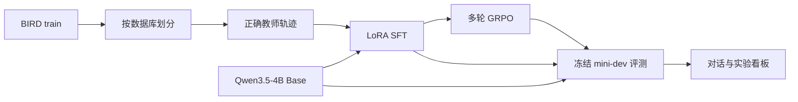

# AgenticRL SQL Lab

这是一个面向大模型 Agent 算法岗位的完整项目。它以 Qwen3.5-4B 为底座，复用 BIRD-RL 的多轮 SQL 任务设计和 verl 训练框架，比较 Base、LoRA SFT、SFT + GRPO 三组模型，并用 Streamlit 对话界面和实验看板展示真实工具轨迹与执行结果。

仓库已经包含数据下载与确定性划分、只读 SQLite 工具、SFT 和 GRPO 脚本、checkpoint 导出、批量评测、对话界面及历史看板。数据版本与 A100 环境已经固定，详见 [DATA_ENVIRONMENT.md](DATA_ENVIRONMENT.md)。GPU 训练尚未执行，仓库不包含虚构 checkpoint 或指标。

## 项目结构



策略只读取问题、schema、字段说明、`db_id` 和工具返回。参考 SQL 只进入隔离奖励函数。`execute_sql` 使用 SQLite 只读 URI、`query_only`、authorizer 和超时；`submit_solution` 会立即结束 episode。

研究问题、消融实验和六周实施计划见 [PROJECT_PLAN.md](PROJECT_PLAN.md)。

## 固定版本

| 组件 | 版本 |
|---|---|
| BIRD 训练记录 | `birdsql/bird23-train-filtered@40684698`，6,601 条 |
| 冻结测试 | `birdsql/bird_mini_dev@f65faf4a`，500 条 |
| BIRD-RL | `b26c4285ef69dfb6c096b076a7499018c6b370ca` |
| verl | `10db40d0da4d59150bb389960b77585f81a89b8d` |
| 模型 | `Qwen/Qwen3.5-4B@851bf6e8` |
| 训练节点 | Ubuntu 24.04、A100 80GB、driver 580+、Python 3.12、CUDA 13.0 |

机器可读配置位于 [configs/data.json](configs/data.json)、[configs/upstreams.json](configs/upstreams.json) 和 [configs/environment.json](configs/environment.json)。

## 本地验证

CPU 检查只依赖 Python 标准库：

```bash
python3 -m unittest discover -s tests -v
python3 -m sql_agent.demo
python3 -m sql_agent.run --help
```

自建的四道 SQLite 题用于验证工具协议、gold 隔离、评分、超时和只读限制，不代表 BIRD 指标。

## AutoDL 初始化

选择 Ubuntu 24.04、A100 80GB 且 NVIDIA driver 580 或更新的实例，将仓库放在持久盘后运行：

```bash
bash scripts/setup_autodl.sh
bash scripts/download_assets.sh
```

第一条命令检出固定上游 commit，应用 [BIRD-RL 只读补丁](patches/bird-rl-readonly.patch)，使用 verl 的固定 `uv.lock` 建立 Python 3.12 训练环境，并把检查结果写入 `outputs/setup/`。第二条命令下载固定 BIRD 数据、SQLite 数据库和 Qwen 模型，生成以下划分：

| 划分 | 数量 |
|---|---:|
| SFT train 来源池 | 1,500 |
| SFT validation 来源池 | 150 |
| GRPO train | 2,000 |
| GRPO validation | 200 |
| 冻结 mini-dev | 500 |

训练集和验证集按 `db_id` 隔离。划分 seed 为 `20260911`，具体数据库清单写入 `data/splits/split_manifest.json`。首次下载后提交生成的 `data/SHA256SUMS`，用于核对数据库归档快照。

## 生成 SFT 轨迹

先为训练来源池生成教师轨迹：

```bash
OUTPUT_DIR="$PWD/outputs/teacher-train" \
BIRD_DATA_JSON="$PWD/data/splits/sft_train.json" \
bash scripts/generate_teacher_trajectories.sh
```

再为验证来源池运行一次：

```bash
OUTPUT_DIR="$PWD/outputs/teacher-val" \
BIRD_DATA_JSON="$PWD/data/splits/sft_val.json" \
bash scripts/generate_teacher_trajectories.sh
```

BIRD-RL 的输出目录名称以实际运行结果为准。把两组最终轨迹和评测文件传给转换脚本：

```bash
export BIRD_SFT_TRAJECTORIES="$PWD/outputs/teacher-train/trajectories/traj_5.jsonl"
export BIRD_SFT_EVALUATION="$PWD/outputs/teacher-train/eval_results.json"
export BIRD_SFT_VAL_TRAJECTORIES="$PWD/outputs/teacher-val/trajectories/traj_5.jsonl"
export BIRD_SFT_VAL_EVALUATION="$PWD/outputs/teacher-val/eval_results.json"
bash scripts/prepare_bird_data.sh
```

转换器只保留执行评测正确的教师轨迹，并转成 Qwen 原生 `tool_calls` 消息。它同时生成 verl RL 文件、冻结评测任务和 tokenizer 长度报告。任何 RL prompt 超过 8,192 token 时会直接失败。

## LoRA SFT

```bash
bash scripts/train_qwen35_4b_sft.sh trainer.total_training_steps=1 trainer.save_freq=1
```

单步检查通过后，运行正式 SFT：

```bash
bash scripts/train_qwen35_4b_sft.sh
```

默认参数为 LoRA rank 32、alpha 64、全局 batch 4、micro batch 1、最大序列 8,192 token、1 epoch。LoRA 覆盖语言模型的线性层并排除视觉模块。训练结束后导出 adapter：

```bash
export CHECKPOINT_DIR="$PWD/checkpoints/qwen35-4b-bird-sft/global_step_N"
export TARGET_DIR="$PWD/exports/qwen35-4b-bird-sft"
bash scripts/export_checkpoint.sh
```

导出的 adapter 位于 `$TARGET_DIR/lora_adapter`。

## 多轮 GRPO

GRPO 从 SFT adapter 继续更新同一组 LoRA 参数：

```bash
export LORA_ADAPTER_PATH="$PWD/exports/qwen35-4b-bird-sft/lora_adapter"
export BIRD_DB_DIR="$PWD/data/databases/train"
bash scripts/train_qwen35_4b_grpo.sh \
  trainer.total_training_steps=1 trainer.save_freq=1 trainer.test_freq=1
```

单步检查通过后，去掉覆盖参数开始正式训练：

```bash
bash scripts/train_qwen35_4b_grpo.sh
```

默认每题采样 4 条轨迹，全局问题 batch 为 4，prompt 上限 8,192，response 上限 4,096。Actor 和 reference 使用 CPU offload，rollout 显存比例为 0.55。正式参数需要根据单步试跑的峰值显存、吞吐和截断统计调整。

GRPO checkpoint 导出时，`CHECKPOINT_DIR` 指向 `global_step_N/actor`。导出的 adapter 包含 SFT 后继续训练的状态。

## 推理与冻结评测

启动一个模型服务：

```bash
# Base
SERVED_NAME=base PORT=8000 bash scripts/serve_qwen35_4b.sh

# SFT
SERVED_NAME=sft PORT=8001 \
LORA_PATH="$PWD/exports/qwen35-4b-bird-sft/lora_adapter" \
bash scripts/serve_qwen35_4b.sh

# SFT + GRPO
SERVED_NAME=sft-rl PORT=8002 \
LORA_PATH="$PWD/exports/qwen35-4b-bird-grpo/lora_adapter" \
bash scripts/serve_qwen35_4b.sh
```

单卡通常顺序加载三组模型。每次启动对应服务后运行同一冻结任务：

```bash
SQL_AGENT_BASE_URL=http://127.0.0.1:8000/v1 \
python3 -m sql_agent.run \
  --model base \
  --profile base \
  --tasks data/processed/bird_mini_dev_tasks.jsonl \
  --output outputs/eval/base.jsonl
```

对 SFT 和 SFT + GRPO 修改 endpoint、模型名和输出路径。每条结果保存最终 SQL、评分、工具消息、token 用量、耗时和原始接口响应。最终公开指标需再用固定 BIRD evaluator 复核。

将本地结果转换成 BIRD-RL 原生 trajectory，并用只读补丁后的固定 evaluator 计算 EX：

```bash
bash scripts/evaluate_bird_run.sh \
  outputs/eval/base.jsonl \
  outputs/eval/base.bird-eval.json
```

对三组模型分别执行。评测脚本要求 500 个 `instance_idx` 完整且唯一；未提交 SQL 的样本按错误处理，并保存逐题结果。

## 对话界面与看板

看板使用独立环境：

```bash
bash scripts/setup_ui.sh
bash scripts/run_dashboard.sh
```

界面包含三个视图：

- `SQL 对话` 在数据准备后列出 mini-dev 的 11 个只读数据库；选择数据库和模型后可自由提问，并显示最终 SQL、查询结果及工具轨迹。自由问题没有 gold，只显示执行状态。
- `模型对比` 对同一固定任务分别调用 Base、SFT、SFT + GRPO，各组不会共享轨迹。
- `实验看板` 读取 `outputs/**/*.jsonl`，汇总准确率、平均工具调用、耗时和任务级结果。

[configs/models.json](configs/models.json) 默认使用 8000、8001、8002 三个端口。只有一张 GPU 时，可以顺序完成评测，再用看板比较历史结果。

## Git 与产物

主仓库跟踪适配代码、配置、文档和测试。`upstream/`、数据、模型、checkpoint 和输出不进入 Git。提交格式遵循 `feat / fix / chore / docs / refactor + 中文说明`。
