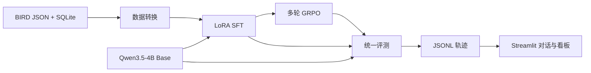

# AgenticRL SQL Lab

这是一个面向大模型 Agent 算法岗位的可运行项目骨架。它将 BIRD-RL 的 SQL 任务、Qwen3.5-4B、当前 verl 训练框架和一个 Streamlit 展示应用串成同一条实验链路，目标是比较 Base、SFT、SFT + GRPO 在多轮 SQL 工具调用上的效果。

当前仓库已完成数据转换、只读 SQL 环境、单卡训练脚本、checkpoint 导出、批量评测、对话界面和历史看板。本机已通过 10 项 CPU 测试。模型训练和显存参数需要在 AutoDL A100 80GB 上实测，仓库不包含虚构 checkpoint 或指标。

完整的研究问题、对照实验和求职展示设计见 [PROJECT_PLAN.md](PROJECT_PLAN.md)。

## 系统结构



多轮 RL 使用原生 tool calling。每个样本只把问题、schema、字段说明和 `db_id` 交给策略；参考 SQL 只进入独立奖励函数。`execute_sql` 使用 SQLite 只读 URI、`query_only` 和 authorizer。自定义 `BirdSqlAgentLoop` 在 `submit_solution` 后立即结束，避免继续生成无效轮次。

## 上游版本

两套上游代码已克隆到本地 `upstream/`，但不提交进主仓库。固定版本保存在 [configs/upstreams.json](configs/upstreams.json)：

| 依赖 | 固定 revision |
|---|---|
| BIRD-RL | `b26c4285ef69dfb6c096b076a7499018c6b370ca` |
| verl | `10db40d0da4d59150bb389960b77585f81a89b8d` |
| 模型 | `Qwen/Qwen3.5-4B` |

[scripts/setup_autodl.sh](scripts/setup_autodl.sh) 会重建上游目录并按 verl 的 `uv.lock` 安装训练依赖。BIRD-RL 源码通过 `PYTHONPATH` 加载，因为该仓库没有 Python 安装清单。

## 本地验证

本地 smoke test 只依赖 Python 标准库：

```bash
python3 -m unittest discover -s tests -v
python3 -m sql_agent.demo
python3 -m sql_agent.run --help
```

自建的四道 SQLite 题用于验证工具协议、gold 隔离、执行评分、超时和只读限制，不代表 BIRD 指标。

## AutoDL 环境

把仓库同步到 A100 80GB 实例后运行：

```bash
bash scripts/setup_autodl.sh
```

脚本把 GPU 信息与实际版本写入 `outputs/setup/`。训练命令都从固定的 verl 目录通过 `uv run` 启动。模型和 BIRD 数据应放在持久盘，密钥只通过环境变量传入。

## BIRD 数据约定

仓库不重新分发 BIRD 数据。输入 JSON 或 JSONL 的每条记录至少需要：

```json
{
  "question_id": 1,
  "db_id": "database_name",
  "question": "natural language question",
  "evidence": "optional evidence",
  "SQL": "reference SQL"
}
```

数据库目录结构为：

```text
databases/
└── database_name/
    └── database_name.sqlite
```

`column_meaning.json` 使用 BIRD-RL 的 `db_id|table|column` 键格式。训练集和验证集必须按数据库划分，不能把同一数据库放进两边。

先生成 RL 数据：

```bash
export BIRD_TRAIN_JSON=/root/data/bird/train.json
export BIRD_VAL_JSON=/root/data/bird/val.json
export BIRD_DB_DIR=/root/data/bird/databases
export BIRD_COLUMN_MEANING=/root/data/bird/column_meaning.json
bash scripts/prepare_bird_data.sh
```

输出是 verl 可直接读取的 JSONL，位于 `data/processed/`。转换器也支持 `.parquet`，该格式需要 `datasets` 和 `pyarrow`。

## SFT 轨迹

SFT 只使用执行评测正确的教师轨迹。可先调用 BIRD-RL 的多轮推理流程：

```bash
export TEACHER_MODEL_PATH=/root/models/teacher
export BIRD_DATA_JSON="$BIRD_TRAIN_JSON"
export OUTPUT_DIR="$PWD/outputs/teacher-train"
bash scripts/generate_teacher_trajectories.sh
```

用独立验证 split 再运行一次并改写 `OUTPUT_DIR`。然后指定两组最终轨迹和评测文件：

```bash
export BIRD_SFT_TRAJECTORIES="$PWD/outputs/teacher-train/trajectories/traj_5.jsonl"
export BIRD_SFT_EVALUATION="$PWD/outputs/teacher-train/eval_results.json"
export BIRD_SFT_VAL_TRAJECTORIES="$PWD/outputs/teacher-val/trajectories/traj_5.jsonl"
export BIRD_SFT_VAL_EVALUATION="$PWD/outputs/teacher-val/eval_results.json"
bash scripts/prepare_bird_data.sh
```

转换器把 BIRD-RL 的 XML 轨迹改成 Qwen 原生 `tool_calls` 消息，并保留工具观察作为 `tool` 消息。错误轨迹不会进入 SFT 文件。

## 单卡 LoRA SFT

```bash
bash scripts/train_qwen35_4b_sft.sh
```

默认配置为 LoRA rank 32、alpha 64、micro batch 1、全局 batch 4、训练 1 epoch。Qwen3.5 使用 Gated Delta Networks，脚本按当前 verl 示例关闭 remove padding 和 dynamic batch。若发生 OOM，先减小 `data.max_token_len_per_gpu` 和样本上下文，再调整 offload，不要静默丢弃超长样本。

训练完成后导出最后一个 `global_step_*`：

```bash
export CHECKPOINT_DIR="$PWD/checkpoints/qwen35-4b-bird-sft/global_step_100"
export TARGET_DIR="$PWD/exports/qwen35-4b-bird-sft"
bash scripts/export_checkpoint.sh
```

LoRA adapter 位于 `$TARGET_DIR/lora_adapter`。具体 step 以 `latest_checkpointed_iteration.txt` 为准。

## 单卡多轮 GRPO

GRPO 从 SFT adapter 继续训练，SFT adapter 同时定义初始策略。训练样本通过自定义 AgentLoop 调用只读 SQL 工具，奖励使用 BIRD-RL 的执行结果评分。

```bash
export LORA_ADAPTER_PATH="$PWD/exports/qwen35-4b-bird-sft/lora_adapter"
export BIRD_DB_DIR=/root/data/bird/databases
bash scripts/train_qwen35_4b_grpo.sh
```

默认每题采样 4 条轨迹，全局问题 batch 为 4，上下文上限 8192，响应上限 4096。Actor 和 reference 参数启用 CPU offload，rollout 的显存比例设为 0.55。这些值是 A100 80GB 的保守起点，尚未在当前 Mac 上运行。先用命令行覆盖 `trainer.total_training_steps=1` 完成一次更新，再开始正式训练：

```bash
bash scripts/train_qwen35_4b_grpo.sh trainer.total_training_steps=1 trainer.save_freq=1 trainer.test_freq=1
```

GRPO checkpoint 导出时，`CHECKPOINT_DIR` 指向 `global_step_N/actor`。导出的 `lora_adapter` 已包含从 SFT 继续更新后的 adapter 状态。

## 批量评测

启动模型服务：

```bash
# Base
SERVED_NAME=base PORT=8000 bash scripts/serve_qwen35_4b.sh

# SFT。另开进程或顺序重启单卡服务
SERVED_NAME=sft PORT=8001 LORA_PATH=/path/to/sft/lora_adapter bash scripts/serve_qwen35_4b.sh

# SFT + GRPO
SERVED_NAME=sft-rl PORT=8002 LORA_PATH=/path/to/rl/lora_adapter bash scripts/serve_qwen35_4b.sh
```

单张 GPU 通常顺序加载三组模型。分别修改 [configs/models.json](configs/models.json) 的端口，运行固定任务，并保留输出：

```bash
SQL_AGENT_BASE_URL=http://127.0.0.1:8000/v1 \
python3 -m sql_agent.run --model base --tasks data/generated/tasks.jsonl
```

每条 JSONL 包含最终 SQL、评分、完整工具消息、接口原始响应、token 用量、耗时和模型标识。接口没有返回 token 用量时保留 `null`。

## 对话界面与看板

```bash
python3 -m pip install -r requirements-ui.txt
bash scripts/run_dashboard.sh
```

界面包含三个标签页：

- `SQL 对话`：选择模型，自由提问，显示最终 SQL、真实查询结果和工具轨迹。自由问题没有 gold，界面显示“无标签”。
- `模型对比`：在同一固定题目上分别调用 Base、SFT、SFT + GRPO，三组运行互不共享轨迹。
- `实验看板`：读取 `outputs/**/*.jsonl`，汇总准确率、平均工具调用、耗时和任务级结果。

默认配置假设三个服务分别监听 8000、8001、8002。若只有一张 GPU，可以顺序运行并用看板比较历史结果；实时三列对比要求对应 endpoint 同时可用。

## Git 维护

主仓库跟踪适配代码、配置、文档和测试。`upstream/`、数据、checkpoint、输出和密钥被 `.gitignore` 排除。更新上游时先修改 [configs/upstreams.json](configs/upstreams.json) 与 setup 脚本中的 revision，再在独立分支完成单步 SFT 和单步 GRPO 回归。

推荐提交顺序为数据适配、训练配置、评测界面、实验结果。实际训练结果和大模型权重放在外部存储，仓库只提交小型指标文件、环境版本和可复现的运行配置。
