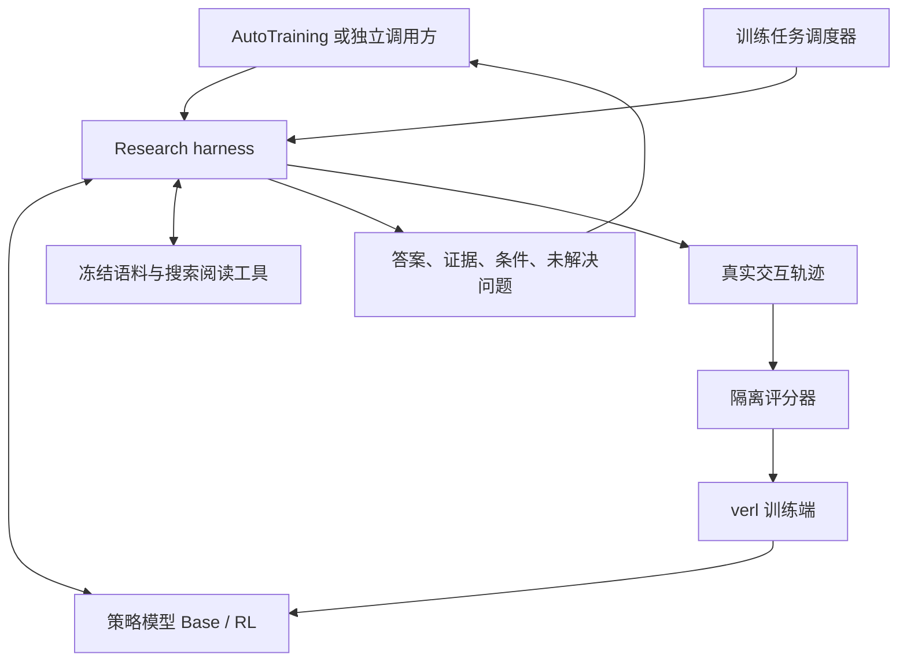

# 科研检索 Agentic RL 方案

状态：CPU harness、32 题合成开发集、PaperSearchQA 50 题开发子集、轨迹看板、冻结 8 题评测入口和 GPU mini-run 脚本已在仓库内实现。本机 Ollama `qwen3.5:4b` 在 8 道 train 题上测过 Base（EM 0.5，不是 HF/A100/16M）。官方 16M PubMed 下载和 Qwen3.5-4B GPU 训练尚未运行。训练目标与验收标准以下文为准。

## 研究问题

以 Qwen3.5-4B 为底座，在相同语料、检索器、上下文和工具预算下，比较 Base 与 GRPO 的问答表现。检验多轮 RL 是否改善查询改写、证据补充和停止决策。RL 增益需要实测，不预设正结果。训练对齐 PaperSearchQA / Search-R1：从底座直接 GRPO，不用教师轨迹做 SFT 冷启动。

腾讯 AutoTraining 已涉及论文分析、复现和实验优化。本独立项目补充 Agent 策略训练与评测经验，使用公开资料。首版交付可验证的短答案和证据；长报告、代码修改和实际 GPU 实验不进入首版动作空间。

## 与 AutoTraining 的配合与项目价值

项目定位为 AutoResearch 工作流中的科研检索子 Agent。AutoTraining 负责论文复现、实验执行与优化流程；本项目训练实验前的信息获取与证据核验能力。首版以公开资料和独立接口演示衔接，尚未接入腾讯生产系统。

核心任务包括确认训练与评测设置、比较方法适用条件、核验改进依据，以及说明证据不足的问题。示例：在复现方法 A 前，核查方法 B 的提升是否依赖额外数据或不同评测设置，将差异交给实验规划端决定对照条件。

拟定接口契约：

| 方向 | 字段 | 约束 |
| --- | --- | --- |
| 请求 | `request_id`、`question`、`research_context`、`environment_id`、`budget` | 不携带隐藏答案或评分标签；上下文只包含调用方已有的信息 |
| 响应 | `answer`、`claims`、`citations`、`conditions`、`unresolved_questions` | 每个事实性 claim 关联引用；未知条件明确标记 |
| 运行信息 | `status`、`trajectory_id`、`policy_version`、`harness_version`、`usage` | 区分完成、预算耗尽、工具失败与证据不足；终止状态不等于答案正确 |

调用方收到结果后制定或修订实验计划；实验发现新的信息缺口时，可再次提交研究问题。先用固定规划模型模拟调用方，隔离检索模块的增益。只有实际运行下游实验后，才报告节省 GPU 时间或减少无效实验；问答指标本身不能证明这些收益。

面试展示围绕一条真实任务展开：原始研究问题、基线遗漏的条件、训练后 Agent 的搜索与证据、据此修订的实验计划。分别说明 AutoTraining 的工程工作、本项目的策略训练贡献以及实测结果，不将计划描述成已落地能力。

## Harness 架构与职责

训练、评测和部署共用轻量 Research harness。Harness 管理模型调用、工具分发、上下文、任务状态、预算与事件；策略模型决定查询、阅读顺序和提交时机。检索服务与文档存储属于环境，隐藏标签属于独立评分器，梯度更新与权重同步属于训练框架。

拟用 verl 作为训练框架：PPOTrainer 负责采样、更新和权重同步。本仓库只实现 Agent Loop 与 reward 插件（`research_agent/training/verl/`），由 `scripts/train/verl_grpo.sh` 启动 `python -m verl.trainer.main_ppo`。接口参考 [Agent Loop 文档](https://verl.readthedocs.io/en/latest/advance/agent_loop.html)。具体接口以选定版本为准。模型调用通过可替换后端完成，训练端使用 rollout 引擎，部署端使用模型服务；两端共用工具 schema、提示词、上下文规则、预算和终止语义。

Harness 不预写搜索路径，不自动替模型改写失败查询。参数校验、超时和调用预算由代码执行。首版不用额外强模型总结观测，避免混入未计量的模型能力；后续若增加摘要或记忆模块，记录其模型、成本和版本并单独消融。

每次 episode 独立保存已读段落、剩余预算、工具结果与终止原因。上下文截断必须显式记录；提交后不得继续执行工具。并发任务隔离状态，工具重试采用有界规则并记录每次尝试。基础设施故障与策略无效动作分别标记，不把服务宕机统一解释为模型能力失败。

代码目录以 [代码目录与依赖规划](CODE_STRUCTURE.md) 为准：`research_agent/harness/` 负责循环，`environment/` 负责工具，`grading/` 负责评分，`models/` 接模型服务，`training/verl/` 接 verl 的 Agent Loop / reward 插件，`integrations/` 接 AutoTraining。评分标签不进入策略输入。

## 上游复用边界

- [Tongyi DeepResearch](https://github.com/Alibaba-NLP/DeepResearch)：参考 ReAct、工具交互和评测入口。不能将推理 quick start 视为完整训练配方，也不宣称完整复现其方法。本仓库训练不采用其教师轨迹 SFT 冷启动。
- [Search-R1](https://github.com/PeterGriffinJin/Search-R1)：参考搜索与生成交错的 rollout、观测 token 的 loss mask、检索服务和结果奖励。其原有模型与框架组合不证明 Qwen3.5-4B 可直接兼容。
- verl：训练框架。科研工具、数据和奖励在本仓库实现为 Agent Loop / `compute_score` 插件。通过最小 GPU 更新后再锁定版本。`research_agent/training/grpo.py` 只是无 verl 时的 HuggingFace 回退，不是 verl 实现。

项目代码集中在 `research_agent/`，配置按数据、harness、模型、训练、评测和实验分组；脚本按 setup、data、train、eval 分组。详见代码目录规划，目录按功能逐步创建。旧 SQL Agent 代码、配置、脚本、测试、演示界面和本地 BIRD 数据已删除。第三方依赖后续按固定版本检出至 `upstream/`，当前目录尚未建立，版本仍待新任务验证。

## 数据决策

流程验证阶段的训练候选选用 [PaperSearchQA](https://jmhb0.github.io/PaperSearchQA/)。官方提供约 60k 事实问答、16M PubMed 摘要检索语料及 Search-R1 兼容代码。这是生物医学科研检索任务，不代表计算机论文研究能力。下载前核对具体数据文件、许可、官方划分和评分器。

先取官方训练划分中的小规模样本检查格式和基线，再确定训练规模。若全量索引超出资源预算，可构建保留支持文档与固定干扰文档的开发子集。子集规则、语料哈希和抽样 seed 必须保存；子集成绩不得与官方全语料成绩直接比较。若原数据缺少支持文档映射，应先验证映射质量，不能假设已有 gold evidence。

[QASPER](https://huggingface.co/datasets/allenai/qasper) 用于后续计算机论文阅读与证据评测。它提供论文全文与问答，属于单论文任务；即使改成检索入口，也不能称为原生跨论文研究基准。保留原始划分，按官方答案类型与评分协议处理。全文问答成绩与检索改造成绩分开报告。

面向 AutoTraining 的核心展示与领域评测必须包含计算机论文任务，不能只用生物医学问答成绩支撑价值。跨论文比较与实验依据核验任务作为第二阶段自建集，先人工审核问题、答案和支持段落。以论文标识及近重复分组隔离训练与测试，记录其规模和覆盖范围，不把少量展示题称为通用 benchmark。

数据产物包括：来源 URL、revision、许可、原始文件校验和、任务划分、文档分块规则、语料与索引版本、排除样本及原因。训练 prompt 和工具观测不含答案标签或证据标签。测试文档可供测试时检索，但测试问答不得进入 RL。

## 数据合成与质量控制

分开保存任务数据和 RL 在线轨迹。任务包含公开问题、环境入口与预算，以及仅供评分器读取的答案、别名、事实要点和参考证据。RL 由当前策略实际调用工具产生轨迹，不能用离线示范冒充在线交互。

合成流程先按论文标识、版本及关联论文组划分资料，再在各划分内部构造任务，避免同一证据组合跨集合泄露：

1. 固定公开文档快照，建立文档与段落 ID，并保存来源和哈希。
2. 从原文抽取训练设置、方法前提、实验结论等事实，关联证据段落。
3. 构造单文档、跨段落或跨文档问题，同时生成答案与评分要点，记录真实任务类别。
4. 用独立验证提示或模型核验答案与证据，人工抽查歧义、缺失条件和生成器共同错误。
5. 在实际工具环境试跑，区分不可检索、证据不足与模型解题失败。检查检索结果是否直接泄露问答标签。
6. 去重并冻结任务清单，保存难度、验证结果、排除原因和生成成本。

参考证据不是唯一合法路径；模型找到其他有效证据时应允许人工复核评分。支持文档信息只能用于离线任务构造、环境子集建立和评分，不以 gold 标记返回模型。评测任务不能根据当前模型的失败样例反复修改。

RL 保留成功与失败轨迹，按同题采样组计算优势。监控全失败组、全成功组与零奖励方差组，避免只按成功率判断信号质量。若按模型表现调整训练难度，记录选择规则并维持固定评测分布。

## 工具环境

拟定三个工具，训练与推理共用实现：

| 工具 | 输入 | 返回或行为 |
| --- | --- | --- |
| `search` | 查询文本 | 固定 top-k 的文档 ID、标题和摘要片段 |
| `open` | 文档 ID、段落范围 | 带稳定段落 ID 的原文 |
| `submit` | 短答案、引用段落 ID | 终止 episode，交给独立评分器 |

检索器先使用固定的词法检索基线，再判断是否需要稠密检索。固定排序、分块和返回长度。无效参数、空检索与重复调用都记录，不自动替模型改写查询。

首轮最多 6 次探索调用，提交单独计数。总生成 token、单次观测长度和上下文均设上限；超预算、截断与工具失败分别标记。引用只能指向本次实际读取的段落，但“读过且 ID 有效”不等于“语义支持结论”。

正式 RL 首轮使用冻结语料。真实网络搜索放在独立迁移评测，记录页面快照和工具费用，不能和固定语料成绩混报。

## 训练与资源

候选环境为 Linux GPU 节点，单张 A100 80GB 作为试跑资源。模型、verl、vLLM、CUDA 与 LoRA 的兼容性尚待验证，不承诺单卡可容纳最终配置。检索服务优先放 CPU，先测索引大小和内存，不默认整套 PubMed 索引可放入本机。

1. 跑 Base 的小验证集，检查工具成功率、答案成功率、轨迹长度和失败原因。
2. 从 Base 权重启动 GRPO（PaperSearchQA / Search-R1 配方）。初始每题 4 条轨迹、小 micro batch、约 8K 上下文，仅作小试起点。验证更新后的权重实际进入 rollout。
3. 完成一次更新、保存、重载和评测，再运行 10–20 步小试。记录峰值显存、每步耗时、token 吞吐、全失败组比例、奖励方差、KL 和截断率。

同题全失败时，GRPO 缺少有效组内信号。先检查数据难度与工具错误，再考虑课程或采样调整；每次改变保留对照。根据小试测量值估算费用与工期，当前不提供未经验证的训练成本。

## 并发采样与异步 RL

分阶段实现，先验证训练正确性，再根据实测瓶颈优化吞吐。

| 阶段 | 执行方式 | 验收重点 |
| --- | --- | --- |
| 同步训练基线 | 固定策略版本采集一批轨迹，评分后更新 | 工具语义、loss mask、权重同步与奖励正确 |
| 并发交互 | 多个 episode 并发，工具 I/O 异步；训练仍按批次同步 | GPU 空等时间、工具延迟、队列等待与慢任务拖尾 |
| 完整异步 RL | rollout 与 trainer 并行，有界队列连接 | 吞吐收益、策略滞后、样本分布和最终质量 |

首版实现前两阶段。单卡 A100 80GB 是否适合采样与训练并行必须实测；不将完整异步列为无条件交付项。

完整异步的拟定约束：

- 每条 episode 和同题 GRPO 组固定行为策略版本。固定版本需要后端明确支持；不支持时在更新前排空在途请求，不能仅写版本标签。
- 轨迹记录 `episode_id`、`group_id`、`policy_version`、`harness_version`、`environment_version`、采样时间、生成 token ID、行为策略 log probability、loss mask、奖励与终止原因。保留逐轮 token，不假定最终 messages 重新 tokenize 等于实际采样序列。
- 区分采样行为策略概率、更新目标中的旧策略概率与 KL reference 概率。采用所选框架支持的修正方式，不用训练时重算概率冒充采样概率。裁剪不能保证任意陈旧样本都有效。
- 组收齐后进入训练队列，避免按完成顺序拼组。为缺失或超时成员定义可复现的处理规则，并报告组丢弃与基础设施失败比例。
- 队列有容量和背压，策略滞后上限通过实验确定；过期轨迹记录后丢弃或按框架支持的规则处理。报告策略版本差、概率偏差和丢弃率。
- 监控短轨迹优先完成导致的分布变化，记录不同难度与长度的接收率。不能静默丢弃长任务来制造吞吐提升。

异步验收同时报告每小时有效完整组、工具等待、训练等待、显存、策略滞后、故障与丢弃率。在相同数据及预算下比较学习曲线和最终指标，不能只以每秒 token 判断优劣。

## 奖励与评测

第一版以数据集匹配的答案正确性奖励为主。事实短答案采用明确的归一化与别名规则，避免长文本堆砌匹配答案。自由文本答案沿用相应评分协议，不强行统一成 exact match。固定评分器版本，人工抽查误判。

证据支持率先作为独立指标。有 gold evidence 时测匹配；缺少标注时在冻结样本上做人工审核，或使用经过校准的 judge 并报告其局限。合法引用比例另行统计，不替代证据支持率。

获得可靠正确性基线后，再做成本奖励消融：`R = S × (1 - λ × c)`。`S` 是答案得分，`c` 是归一化探索成本，`0 ≤ λ < 1`。首轮 `λ = 0`，后续仅用验证集选权重。该奖励本身不保证证据真实。

对照包括无检索 Base、固定检索 RAG、Base Agent、GRPO Agent。后两者共享工具环境和推理预算，固定检索 RAG 单独说明检索预算。报告答案指标、证据指标、调用数、生成 token、耗时和失败率；按 2、4、6 次探索预算绘制准确率与成本曲线。

实验固定 harness 版本后比较模型，隔离训练收益。修改工具返回长度、上下文处理、提示词或重试规则时，固定模型做另一组 harness 消融，不同时改动多个因素后全部归因于 RL。

另设下游实验规划评测：固定规划模型、提示词、任务和生成预算，比较无检索、普通检索、训练后 Research Agent 三种输入。以人工盲评检查计划中的设置错误、无依据断言与关键条件遗漏，记录评分规则和评审一致性。研究阶段与规划阶段成本分别报告；此评测不等于实际实验成功率。

验证集用于调参，测试集最后冻结评测。优先报告任务级配对置信区间；不同训练种子用于衡量训练波动，两者不可互相替代。单种子结果必须明确标注。

## 展示与验收

看板展示问题、搜索词、返回文档、阅读段落、最终答案、引用、模型版本和成本。相同问题可比较不同 checkpoint，所有轨迹来自真实事件。历史回放与在线运行明确区分；未运行显示未运行，不填零分或模拟成绩。

按以下顺序交付：

1. 数据审计和 20–50 题开发集：验证支持文档可检索，排除答案泄露。
2. CPU harness 与工具环境：验证预算、终止、状态隔离、引用可访问性、标签隔离、事件回放与训练部署一致性。
3. Base 与固定检索基线：先得到真实失败分布。
4. GRPO GPU 小试：验证 loss mask、权重同步、保存重载和费用。
5. 冻结评测与对比看板：固定 harness 比较模型，展示计算机科研案例和下游规划盲评，包含负结果。
6. 依据性能剖析决定是否实施完整异步 RL，提交吞吐、策略滞后与质量对照。

当前完成项：方向确认、公开来源初查、方案文档、CPU harness、32 题合成开发集、PaperSearchQA 50 题开发子集、脚本基线、Ollama 4B Base 小验证集与看板对照、cs-005 固定规划器三路对照（训练后 checkpoint 保持未运行）、verl Agent Loop / reward 插件与异步 RL 门控。官方全量数据、Qwen3.5-4B 训练和 GPU 指标未宣称已经实现。
